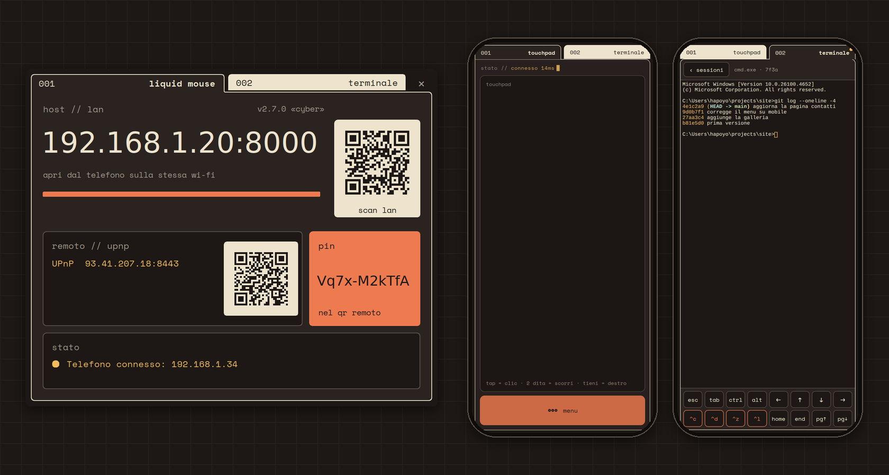
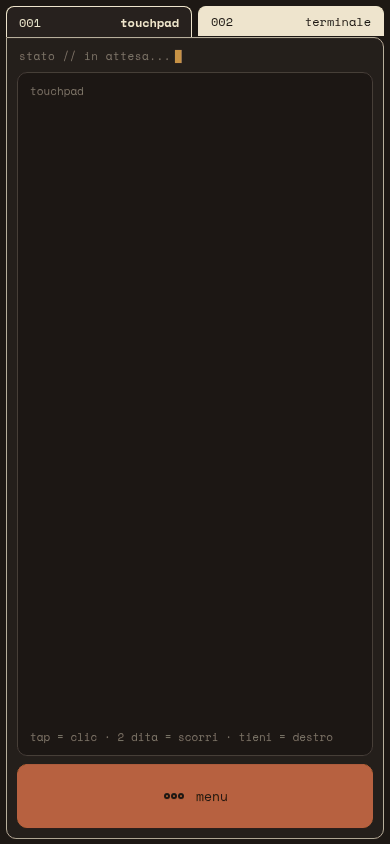
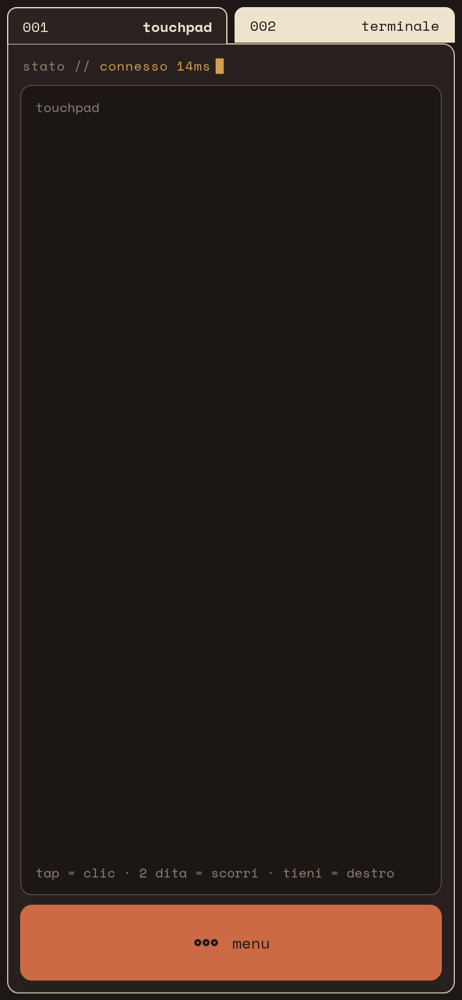
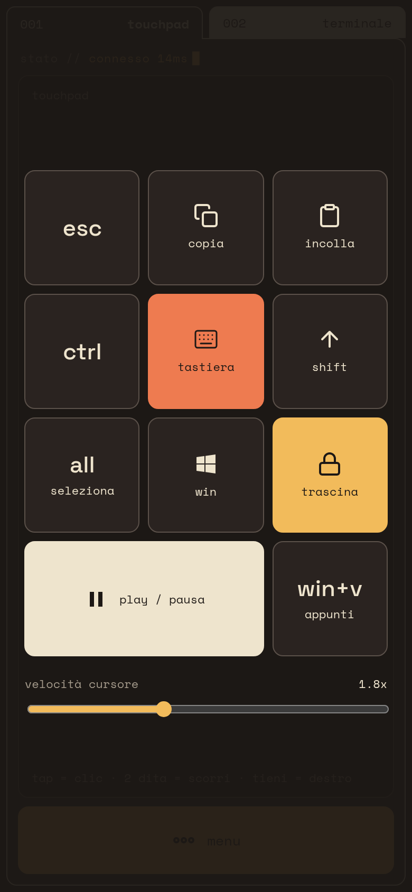
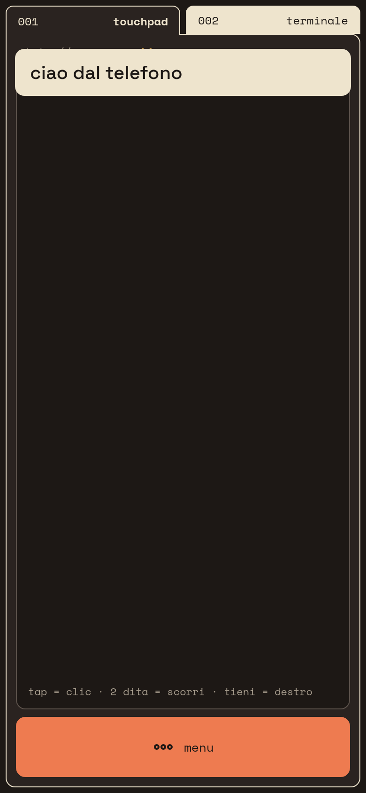
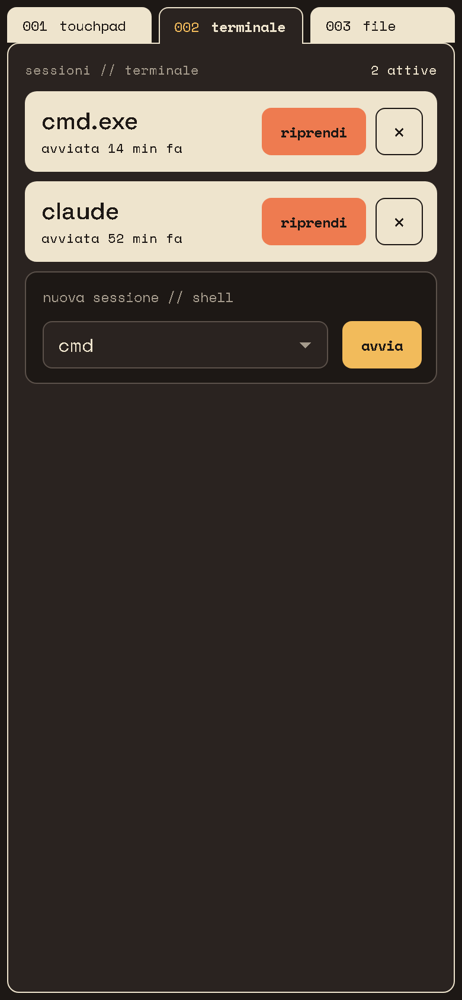
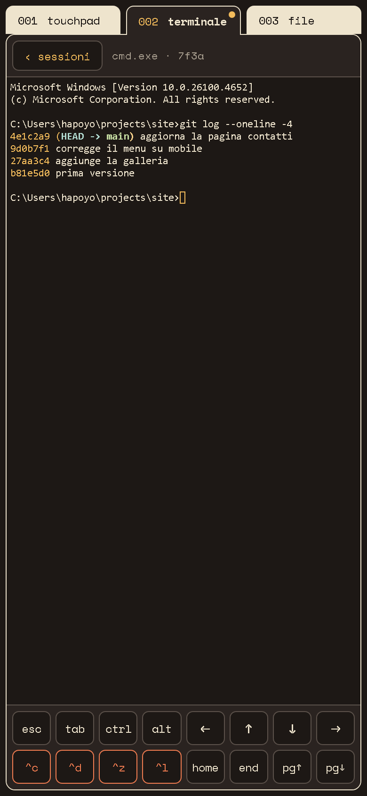
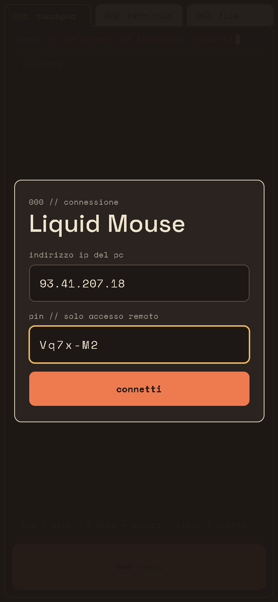
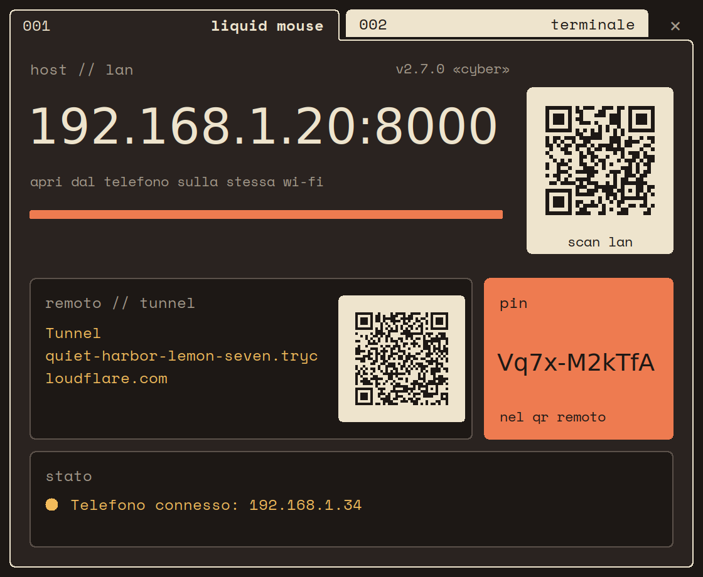
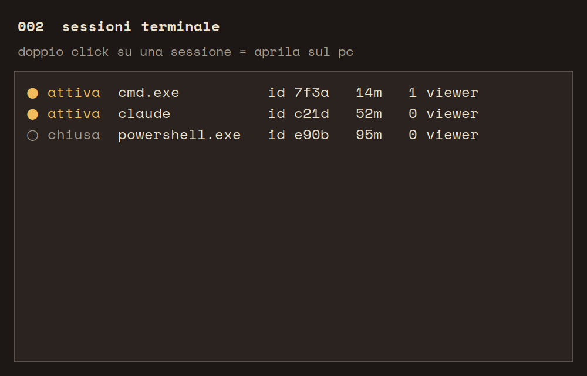

# Liquid Mouse

> v2.9.0 «Cyber» · 2026-10-04

Turn your phone into a wireless touchpad, keyboard and terminal for a Windows PC.
Nothing to install on the phone: the PC serves the client as a web page, you scan a QR code
and the browser does the rest — on the same Wi-Fi or from anywhere.

[](https://github.com/Hapoyo/LiquidMouse/actions/workflows/test.yml)
[](https://github.com/Hapoyo/LiquidMouse/releases/latest)


[](LICENSE)



> **In italiano** — Liquid Mouse trasforma il telefono in touchpad, tastiera e terminale per
> un PC Windows. Sul PC gira un piccolo server con una finestra e un'icona nella tray; sul
> telefono basta il browser: si inquadra il QR e si usa, senza app. In casa passa dalla rete
> Wi-Fi, fuori casa da HTTPS con PIN, aprendo la porta del router via UPnP o, dietro CGNAT,
> con un tunnel Cloudflare gratuito. Il terminale è una vera shell di Windows (cmd.exe) nel
> browser, con sessioni che sopravvivono alla disconnessione. L'interfaccia è in italiano e
> condivide lo stile "cyber" di [PiDash](https://github.com/Hapoyo/PiDash); il download è in
> [Releases](https://github.com/Hapoyo/LiquidMouse/releases/latest).

## 1. Features

- **Touchpad** — tap to click, double-tap, long-press for right click, two-finger scroll,
  drag lock. Sub-pixel accumulation keeps slow movements smooth; speed is adjustable and
  remembered by the phone.
- **Keyboard** — the phone's own keyboard, Unicode included; what you type is echoed on
  screen. A quick menu adds `esc`, copy, paste, select all, `win`, `win+v`, play/pause and
  `ctrl`/`shift` locks.
- **Real terminal** — `cmd.exe`, PowerShell, `pwsh`, WSL, `bash` or `claude` (whichever is
  installed) running on the PC, shown with xterm.js. Sessions survive
  disconnections (64 KB of scrollback is replayed on return), several phones can watch the
  same session, and a session started from the phone also opens in a window on the PC.
  A two-row key bar provides arrows, `esc`, `tab`, one-shot `ctrl`/`alt`, `home`/`end`,
  page up/down and `^c ^d ^z ^l`.
- **Zero install on the phone** — any modern mobile browser; the page follows the on-screen
  keyboard so the prompt line never disappears behind it.
- **Works away from home** — HTTPS/WSS on a single port with a PIN. The PC asks the router
  to open it via UPnP; when that is impossible (CGNAT, double NAT) it starts a free
  Cloudflare quick tunnel instead. Either way the QR code carries the address and the PIN.
- **Secure by default** — first-come whitelist on the LAN, PIN with brute-force lockout for
  remote access, static files served from an explicit whitelist.
- **Light on both ends** — terminal output travels as raw binary frames, assets are cached
  in memory with ETags, and the phone sends input only while your finger moves.
- **One executable** — `LiquidMouse.exe`, built and published by GitHub Actions.

## 2. Screenshots

<p align="center">
  
</p>

On the phone:

| 001 · Touchpad | Quick menu | Typed text |
|:---:|:---:|:---:|
|  |  |  |
| **002 · Sessions** | **002 · Terminal** | **Remote access: PIN** |
|  |  |  |

On the PC:

| Remote access via UPnP | Remote access via Cloudflare tunnel |
|:---:|:---:|
|  |  |

<p align="center">
  <br>
  <sub><b>002 · Terminal sessions</b> — double-click a row to open it in a window on the PC</sub>
</p>

Images generated from the code with demo data (addresses, PIN and sessions are made up):
see [§ 7.3](#73-previews).

## 3. Requirements

| Component | Requirement |
|---|---|
| PC | Windows 10 (1809+) or Windows 11 |
| Phone | any recent browser: Safari on iOS, Chrome or Firefox on Android |
| Network, at home | phone and PC on the same Wi-Fi; TCP `8000` and `8765` allowed by the firewall |
| Network, away | nothing: UPnP on the router, or the Cloudflare tunnel when UPnP can't work |
| From source | Python 3.10–3.13 (3.14 is not supported yet: `miniupnpc` has no wheel) |

## 4. Installation

### 4.1 Executable

Download `LiquidMouse_vX.Y.Z.exe` from
[Releases](https://github.com/Hapoyo/LiquidMouse/releases/latest) and run it. No installer,
no administrator rights. Settings, PIN and certificate live in `%APPDATA%\LiquidMouse`.

The first time, Windows Firewall asks whether to allow the program on private networks:
allow it, otherwise the phone can't reach the PC.

### 4.2 From source

```bash
git clone https://github.com/Hapoyo/LiquidMouse.git
cd LiquidMouse
py -3.13 -m pip install -r requirements.txt
py -3.13 server.pyw
```

### 4.3 Update

Download the new executable and replace the old one: settings stay in `%APPDATA%`, so the
PIN saved on your phones and the certificate you already accepted keep working.

## 5. Usage

1. Start Liquid Mouse on the PC: the window opens and an icon appears in the tray.
2. Scan a QR code with the phone camera:
   - **scan lan** — at home, on the same Wi-Fi (`http://<pc-ip>:8000`);
   - **remoto // upnp** or **remoto // tunnel** — from anywhere, PIN included in the link.
3. Use the **001 touchpad** and **002 terminale** tabs on the phone.
4. Closing the window with `×` hides it in the tray; to quit, tray icon → **Esci**.

### 5.1 Connections

| | LAN | Remote · UPnP | Remote · tunnel |
|---|---|---|---|
| When | same Wi-Fi | router with UPnP and a public IP | CGNAT, double NAT, UPnP off |
| Address | `http://192.168.x.x:8000` | `https://<public-ip>:8443` | `https://<words>.trycloudflare.com` |
| Certificate | — | self-signed: accept the warning once | valid, no warning |
| PIN | no (first device wins) | yes, in the QR | yes, in the QR |
| Notes | reset the device from the tray menu | fallback ports `9443`…`38443` if the router keeps `8443` | new address at every start; `cloudflared` downloaded once |

The PC picks the remote path on its own: UPnP when the router opens the port, otherwise
the tunnel. The mapping is renewed every 10 minutes and survives router reboots.

### 5.2 Gestures

| Gesture | Action |
|---|---|
| tap | left click |
| double tap | double click |
| hold (0.65 s) | right click |
| two fingers up/down | scroll |
| **menu → trascina** | drag lock: move to select or drag, tap again to release |
| **menu → ctrl / shift** | held until tapped again |

### 5.3 Terminal

**002 terminale** lists the sessions running on the PC: **riprendi** re-attaches one,
the **nuova sessione** card starts a new one in the shell picked from its drop-down (only the
shells installed on the PC are offered; the choice is remembered), `×` (twice, to confirm) ends it. **‹ sessioni** goes back to
the list without closing anything. The PC's **002 terminale** tab shows the same list;
double-click a row to open that session in a window on the PC.

## 6. Security

- **LAN** — the first device that connects is trusted; others are refused until you reset
  it from the tray menu. The CGNAT range `100.64.0.0/10` counts as remote, not LAN.
- **Remote** — a random PIN (`secrets.token_urlsafe`) generated on first start, checked as a
  SHA-256 hash; 5 wrong attempts block the address for 30 minutes. Behind the tunnel every
  client arrives from loopback, so the PIN is always required and the lockout uses the real
  client IP (`CF-Connecting-IP`). The phone never retries a wrong PIN on its own.
- **Files** — the HTTP servers answer only for the files in an explicit whitelist; any other
  path is a 404.
- **Terminal** — only whitelisted shells can be started; every value coming from the phone
  is validated and clamped.

## 7. Development

Tests run on Linux, without Windows or a screen: Win32, Tk and the network are replaced by
stubs.

```bash
pip install pytest websockets
python -m pytest                 # 566 tests, the same ones CI runs on every push
py -3.13 server.pyw              # run from source (Windows)
py -3.13 test_server.py          # smoke test against the running server (Windows)
py -3.13 build.py                # build EXE/LiquidMouse.exe  (--pre: archive a candidate)
```

### 7.1 Architecture

```
server.pyw          entrypoint: builds the dependencies and wires them, no logic
liquidmouse/
  net/              HTTP/WS servers, message protocol, static whitelist, binary frames,
                    UPnP, Cloudflare tunnel, SFTP file manager
  input/            key names → virtual keys, SendInput
  terminal/         sessions, ConPTY (pywinpty or ctypes), command whitelist, ring buffer
  security/         PIN and brute-force lockout, self-signed certificate
  gui/              desktop window, tray, sessions panel — the only package using Tk
static/             phone client: index.html, app.css, app.js, fonts, xterm.js
tests/              pytest suite
tools/anteprime.py  regenerates the images in docs/img
```

The GUI depends on the core, never the other way round: the core reports through
`events.log_message` and the window is just one of its listeners. Code conventions, the lists
that must stay aligned and the reasons behind each choice are in [CLAUDE.md](CLAUDE.md).

### 7.2 Workflow

Every change goes through a branch and a pull request to `main`, merged once CI is green.
A release is published by running the `build` workflow on `main` with `pubblica=true` (or by
pushing a `vX.Y.Z` tag matching `liquidmouse/version.py`): GitHub Actions builds the
executable on Windows and attaches it to the release. History: [CHANGELOG.md](CHANGELOG.md).

### 7.3 Previews

The screenshots, the GIF and the cover are drawn by the real code with demo data: the phone
client runs in Chromium at 390 px against a fake PC, the desktop window runs under Xvfb.

```bash
pip install playwright pillow qrcode        # plus tkinter from the system
xvfb-run -s "-screen 0 1920x1080x24 -dpi 192" python tools/anteprime.py
```

## 8. Troubleshooting

**The phone won't connect on the LAN** — same Wi-Fi network? Windows Firewall must allow TCP
`8000` and `8765`. Some routers isolate Wi-Fi clients from each other ("AP isolation"):
disable it in the router settings.

**Remote shows "non disponibile"** — when UPnP fails the PC falls back to the Cloudflare
tunnel, so the panel usually shows the tunnel state:
- *tunnel: download di cloudflared…* / *avvio del tunnel…* — wait a few seconds.
- *tunnel: download di cloudflared fallito* — the PC can't reach github.com; check the
  firewall/antivirus, or put `cloudflared.exe` in `%APPDATA%\LiquidMouse\bin` by hand.
- *tunnel: quick tunnel provisioning failed…* — Cloudflare refused the tunnel (rate limit);
  it retries by itself.

The UPnP reasons, shown when the tunnel isn't running:
- *nessun router UPnP/IGD trovato* — UPnP is disabled in the router settings.
- *il router ha rifiutato la mappatura* — the router refused `8443` and every fallback port.
- *doppio nat, modem a monte* — your router sits behind the ISP modem. Put the modem in
  bridge mode, or forward TCP `8443` on the modem to your router.
- *cgnat dell'operatore* — the ISP shares one public address among customers; no port can
  be opened from home. Use the tunnel, or ask the ISP for a public IP.

**The browser warns about the certificate** — expected with UPnP: the certificate is
self-signed. Accept it once; the tunnel address has a valid certificate.

**Stuck on "In attesa…"** — reload the page (an old client may be cached). If it persists,
run `py -3.13 test_server.py` on the PC and check the browser console.

## 9. Documentation

| Document | Contents |
|---|---|
| [CHANGELOG.md](CHANGELOG.md) | changes by version |
| [CONTRIBUTING.md](CONTRIBUTING.md) | bug reports, pull requests, tests to run |
| [CLAUDE.md](CLAUDE.md) | structure, conventions, design decisions, known limits (Italian) |

## 10. Credits and licenses

- **Code**: MIT — see [LICENSE](LICENSE). Use it, fork it, ship it.
- **Fonts**: Space Grotesk and Space Mono, SIL Open Font License 1.1 (`static/fonts/OFL-*.txt`).
- **Terminal**: [xterm.js](https://xtermjs.org), MIT.
- **Remote tunnel**: [cloudflared](https://github.com/cloudflare/cloudflared), Apache 2.0,
  downloaded at runtime and not bundled.
- **Style**: the "cyber" theme of [PiDash](https://github.com/Hapoyo/PiDash).

Made by [Hapoyo](https://github.com/Hapoyo).
